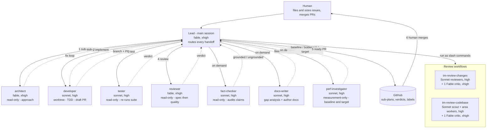

# OrchestrAI

A personal AI-team-orchestrator plugin for Claude Code: a `CLAUDE.md`, a
bootstrap checklist, and a ready-made agent team, adopted into your existing
repos via the Claude Code marketplace (see "Getting the team into your repos"
below).

- `CLAUDE.md` - standing guidance for Claude Code sessions: what the repo is,
  where decisions live, code style, useful commands.
- `.claude/team-guide.md` - generic team process guidance (agent team, advisor
  model, model policy, sizing, the issues/branches/commits conventions,
  how-to-pick-up-a-task, what-not-to-do). Imported by the repo CLAUDE.md; a
  config dir imports it from the marketplace clone instead (see "Getting the
  team into your repos" below).
- `NEW-PROJECT-SETUP.md` - the once-per-repo adoption checklist: branch
  protection, installing the plugin, docs structure, CI/CD and e2e wiring,
  and the first slice of work. Stays in the repo as a living checklist; it
  is not deleted once checked off.
- `.claude/agents/` - the role agents: architect (approach, read-only),
  developer (one issue end to end, worktree-isolated), tester (independent
  verification, read-only), reviewer (spec pass then quality pass, read-only),
  fact-checker (audits report and PR claims against evidence, read-only),
  docs-writer (authors user-facing docs from a gap analysis, on demand),
  perf-investigator (measures a baseline and target for a reported slowness,
  read-only except for measurement).
- `.claude/skills/tm-advisor/` - `/tm-advisor`: the operating model on top of the
  team. Refines a raw need into a batch of work packages, takes one sign-off,
  runs the batch uninterrupted through the kickoff pipeline, and reports.
  State lives in a batch tracking issue, so a dropped session resumes. Design:
  `docs/superpowers/specs/2026-06-12-advisor-operating-model-design.md`.
- `.claude/skills/tm-kickoff/` - `/tm-kickoff`: fans refined, sized issues out to
  the agent team in parallel waves, through implement, test, and review, to a
  ready PR per issue.
- `.claude/skills/tm-grill-me/` - `/tm-grill-me`: stress-tests a plan one question
  at a time before kickoff (from mattpocock/skills, MIT).
- `.claude/skills/tm-to-issues/` - `/tm-to-issues`: turns an approved plan into
  sized, dependency-ordered issues ready for `/tm-kickoff` (adapted from
  mattpocock/skills, MIT).
- `.claude/skills/tm-new-project/` - `/tm-new-project`: runs the
  `NEW-PROJECT-SETUP.md` checklist as a guided flow. Creates the workflow
  labels and docs tree, then prints the human-only steps (branch protection,
  CI, plugin install, design-plugin vetting). Idempotent, and does not
  delete `NEW-PROJECT-SETUP.md`.
- `.claude/workflows/` - bounded orchestration scripts. `tm-review-changes`
  reviews a diff with a fixed set of Sonnet reviewers plus one Fable critic;
  `tm-review-codebase` audits the whole repo with a Sonnet scout that splits it into
  areas (scaled to the repo, capped at a ceiling), per-area Sonnet workers, an
  architecture worker, and one Fable critic. Both pin models in-script so the cost
  is bounded by construction.
- `.claude/settings.json` - enables obra's superpowers plugin per project
  (`superpowers@claude-plugins-official`; the methodology skills:
  brainstorming, writing-plans, TDD, verification).
- `.claude-plugin/marketplace.json` - the marketplace catalog, pointing the
  `orchestrai` plugin at the `.claude/` root. The plugin manifest itself lives
  at `.claude/.claude-plugin/plugin.json` (see "Getting the team into your
  repos" below).

Generalized from two project `CLAUDE.md` files (a Python advisory bot and a
TypeScript web app), keeping the shared backbone and dropping the project
specifics.

The four global coding principles live in `~/.claude/CLAUDE.md` and apply to
every project; this plugin references them rather than repeating them.

## How the team works

The diagram below is the combined overview; `docs/team-architecture.md` has the
detailed flat-star and per-package diagrams.



## Getting the team into your repos

Two ways, depending on whether the team should be committed to the repo.

**Plugin install, via the marketplace (recommended).** This repo is a
single-plugin marketplace (`.claude-plugin/marketplace.json`), so any machine
with Claude Code can install the team without cloning or copying anything,
including a user config dir for repos you must not commit the team to (an
org's private repo):

```text
/plugin marketplace add sv-tmueller/orchestrai
/plugin install orchestrai@orchestrai
```

This installs the agents and all 7 skills under the `orchestrai` namespace,
for example `/orchestrai:tm-advisor` and `/orchestrai:tm-kickoff`. The two
review workflows (`tm-review-changes`, `tm-review-codebase`) ship as thin
wrapper skills, since plugin `workflows/` is not an official component type.
Current Claude Code builds may also register the two workflows directly under
the plugin namespace, producing duplicate menu entries; this is undocumented
behavior, and the wrapper skills remain the supported path.

A plugin cannot place `team-guide.md` where a config-dir `CLAUDE.md` can
import it, so wire that import yourself: add
`@plugins/marketplaces/orchestrai/.claude/team-guide.md` to
`<config-dir>/CLAUDE.md` (the path is relative to that file; the marketplace
clone auto-updates, so the import always tracks the latest guide). Note that
a config-dir `CLAUDE.md` replaces `~/.claude/CLAUDE.md` instead of stacking
with it, so re-import the four global coding principles in the same file if
you rely on them. A repo that carries its own committed team overrides the
plugin's copy, so the two never clash.

A plugin cannot install another plugin for you: the `developer` and `tester`
agents and `tm-advisor` depend on obra's superpowers plugin, so enable it
yourself first if it is not already:

```text
/plugin marketplace add anthropics/claude-plugins-official
/plugin install superpowers@claude-plugins-official
```

**Committed in the repo.** Copy the whole `.claude/` tree from this repo into
yours instead of installing the plugin, for a repo where the team must be
committed rather than installed from the marketplace. To update it later,
copy the changed files from this repo's `.claude/` into the target repo's
`.claude/` and open a PR.

## License

**Copyright © 2026 Thomas Mueller. All rights reserved.**

This source code is published for demonstration and portfolio purposes only. No license is granted to use, copy, modify, merge, publish, distribute, sublicense, or sell any part of this software, in whole or in part, in any other project (public or private) without prior written permission from the copyright holder.

Unauthorized reuse of any portion of this code constitutes copyright infringement and will be pursued accordingly.

### Third-party material

Two skills carry their own MIT attribution because they are adapted from an
MIT-licensed source: `.claude/skills/tm-grill-me/SKILL.md` (near-verbatim,
from `mattpocock/skills`) and `.claude/skills/tm-to-issues/SKILL.md`
(substantially adapted, from the same source). Their attribution footers and
the source project's full MIT license text are in `THIRD_PARTY_NOTICES.md`.
This does not change the license of the rest of the repo above; it is a
normal mixed-license pattern where a small amount of MIT-derived material
keeps its own attribution inside an otherwise all-rights-reserved codebase.

The research on `vijaythecoder/awesome-claude-agents`
(`docs/research/2026-07-04-awesome-claude-agents-adoption.md`) and the
flat-star diagram credit to `owainlewis/youtube-tutorials`
(`docs/team-architecture.md`) use only ideas and observations from those
sources, not file copies, so no attribution is required for them beyond the
credit already given in place.
