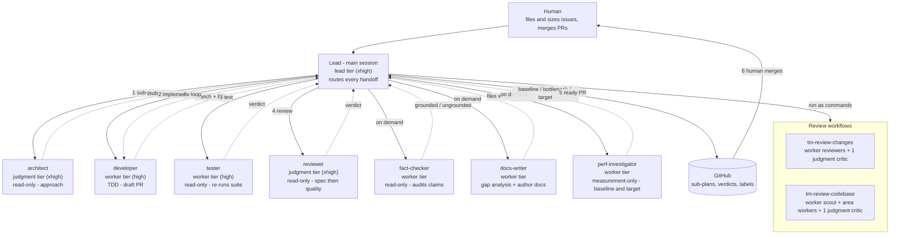

# OrchestrAI

A tool-independent AI-team-orchestrator: a ready-made agent team that takes
GitHub issues from sub-plan to ready PR through a flat-star pipeline
(architect, developer, tester, reviewer). Runs on two hosts:

- **Claude Code** via the plugin marketplace (Opus/Sonnet/Fable)
- **Hermes Agent** via a Hermes skill (GLM-5-2 or any configured model)

A Codex adapter (subscription auth, o3/gpt-5.6) is built but not yet
live-tested.

## How the team works

The same pipeline runs on every host. Models are abstracted through tiers
(judgment, worker, lead); each host's adapter table maps tiers to concrete
models. The lead session routes every handoff; role agents never call each
other.


```mermaid
graph TD
    H["Human<br/>files and sizes issues, merges PRs"] --> L
    L["Lead - main session<br/>lead tier (xhigh)<br/>routes every handoff"]

    L -->|"1 sub-plan"| A["architect<br/>judgment tier (xhigh)<br/>read-only - approach"]
    A -.->|"sub-plan"| L
    L -->|"2 implement"| D["developer<br/>worker tier (high)<br>TDD - draft PR"]
    D -.->|"branch + PR"| L
    L -->|"3 test"| T["tester<br/>worker tier (high)<br/>read-only - re-runs suite"]
    T -.->|"verdict"| L
    L -->|"4 review"| R["reviewer<br/>judgment tier (xhigh)<br/>read-only - spec then quality"]
    R -.->|"verdict"| L
    L -.->|"fix loop"| D
    L -->|"on demand"| F["fact-checker<br/>worker tier<br/>read-only - audits claims"]
    F -.->|"grounded / ungrounded"| L
    L -->|"on demand"| DW["docs-writer<br/>worker tier<br/>gap analysis + author docs"]
    DW -.->|"files written"| L
    L -->|"on demand"| P["perf-investigator<br/>worker tier<br/>measurement-only - baseline and target"]
    P -.->|"baseline / bottleneck / target"| L

    L -->|"5 ready PR"| G[("GitHub<br/>sub-plans, verdicts, labels")]
    G -->|"6 human merges"| H

    subgraph WF["Review workflows"]
        RC["tm-review-changes<br/>worker reviewers + 1 judgment critic"]
        RB["tm-review-codebase<br/>worker scout + area workers + 1 judgment critic"]
    end

    L -->|"run as commands"| WF
```

Detailed diagrams: `docs/team-architecture.md`. Adapter interface:
`docs/architecture/adapter-interface.md`.

## Components

- `.claude/agents/` - 7 role agents (architect, developer, tester, reviewer,
  fact-checker, docs-writer, perf-investigator). Each pins a tier, not a
  model name.
- `.claude/adapters/` - the portable adapter layer. Adapter tables
  (`claude-code.json`, `hermes.json`, `codex.json`) map tiers to concrete
  models per host. Role prompt templates (`prompts/<role>.md`) carry the
  host-neutral job descriptions and report contracts.
- `.claude/workflows/` - 3 bounded orchestration scripts (tm-review-changes,
  tm-review-codebase, tm-map-codebase). Fan-out is encoded as JSON data
  specs under `workflows/specs/`; the JS files embed matching SPEC constants
  and a sync test asserts alignment.
- `.claude/skills/` - slash commands: `/tm-kickoff` (pipeline driver),
  `/tm-advisor` (batch advisory), `/tm-grill-me` (plan stress-test),
  `/tm-ab-test` (A/B comparison), `/tm-new-project` (repo setup). Hermes
  variants ship as `SKILL.hermes.md` alongside the Claude versions;
  `tm-kickoff` becomes the `orchestrai` skill and `tm-advisor` becomes
  the `tm-advisor` skill on Hermes.
- `.claude/team-guide.md` - team process guidance (agent roster, advisor
  model, model policy, how to pick up a task).
- `.claude/process-core.md` - neutral rules (issues, branches, sizing,
  commits, tests, CI, writing style). Imported by the repo `CLAUDE.md` or
  `AGENTS.md`.
- `NEW-PROJECT-SETUP.md` - once-per-repo adoption checklist.

## Zone 1: Claude Code

### Install

Via the marketplace (recommended):

```text
/plugin marketplace add sv-tmueller/orchestrai
/plugin install orchestrai@orchestrai
```

Installs the agents and all 7 skills under the `orchestrai` namespace
(e.g. `/orchestrai:tm-kickoff`). Wire the process docs into your
config-dir `CLAUDE.md`:

```text
@plugins/marketplaces/orchestrai/.claude/process-core.md
@plugins/marketplaces/orchestrai/.claude/team-guide.md
```

The `developer` and `tester` agents depend on the superpowers plugin:

```text
/plugin marketplace add anthropics/claude-plugins-official
/plugin install superpowers@claude-plugins-official
```

Alternatively, copy the whole `.claude/` tree into your repo if the team
must be committed rather than installed from the marketplace.

### Use

```text
/tm-kickoff 42          # run the pipeline on issue #42
/tm-kickoff 42 43 44    # run a wave of issues (up to 3 concurrent)
/tm-advisor <need>      # refine a need into a batch, then run it
/tm-review-changes      # review the current diff
/tm-review-codebase     # review the whole repo
/tm-map-codebase        # map the repo architecture
```

### Model config

The adapter table at `.claude/adapters/claude-code.json`:

| Tier | Model | Effort | Roles |
|------|-------|--------|-------|
| judgment | opus | xhigh | architect, reviewer |
| worker | sonnet | high | developer, tester, fact-checker, docs-writer, perf-investigator |
| lead | fable | xhigh | the lead session |

Fallback: judgment-tier failures retry on the worker tier (Opus to Sonnet),
flagged in the report. Nothing runs at max effort.

## Zone 2: Hermes Agent (GLM-5-2)

### Install

Two Hermes skills ship with this repo:

- **orchestrai** - the pipeline driver (architect, developer, tester,
  reviewer). Auto-discovered at
  `~/.hermes/skills/autonomous-ai-agents/orchestrai/`.
- **tm-advisor** - the batch advisor (refine a need, propose a batch,
  get sign-off, dispatch the pipeline). Auto-discovered at
  `~/.hermes/skills/autonomous-ai-agents/tm-advisor/`.

Both skill sources live in the repo as `SKILL.hermes.md` alongside
their Claude counterparts under `.claude/skills/`. Run
`hermes skills list` to confirm they appear. No install step is needed
on the machine where the skill files are present.

To install on another machine, publish the skill directory as a GitHub
repo and tap it:

```bash
hermes skills tap add sv-tmueller/orchestrai
hermes skills install orchestrai
```

### Use

#### orchestrai (pipeline driver)

Just ask. The skill is auto-discovered in every Hermes session, so the
model loads it when you mention the orchestrator team. No preload needed:

```bash
hermes chat -q "Run the orchestrator team on issue #42"
```

Or interactively:

```bash
hermes
> Run the orchestrator team on issue #42
```

For scripted or automated runs where you want zero ambiguity, preload the
skill explicitly with `-s` so its full text is in context from the first
token:

```bash
hermes -s orchestrai chat -q "Run the orchestrator team on issue #42"
```

The lead session (GLM-5-2 or whatever you configured) reads the skill,
follows the flat-star pipeline, and dispatches each role agent via
`delegate_task` as a leaf worker. Role prompts are loaded from the
skill's `references/roles/` directory.

#### tm-advisor (batch advisory)

Refine a raw need into a batch of work packages, get one sign-off, then
run the batch unattended through the orchestrai pipeline:

```bash
hermes -s tm-advisor chat -q "We need to clean up the test helpers and add integration tests for the adapter layer"
```

Or interactively:

```bash
hermes
> (load tm-advisor) We need to clean up the test helpers ...
```

With no arguments, tm-advisor enters the resume path: it finds open batch
tracking issues and continues or proposes the next batch:

```bash
hermes -s tm-advisor
```

The advisor loads the orchestrai pipeline via `skill_view` at dispatch
time, so you do not need to preload orchestrai separately. The advisor
holds the sign-off gate; after it, the run is unattended.

### How it maps to Hermes

| Claude Code | Hermes |
|---|---|
| Agent tool dispatch | `delegate_task` with `role="leaf"` |
| Workflow `agent()` / `parallel()` | `delegate_task` (sequential or batch) |
| Worktree isolation | Branch isolation via terminal in the delegated session |
| `gh pr diff`, `gh issue view` | `terminal` tool with `gh` commands |
| Frontmatter `model:` / `effort:` | Adapter table `hermes.json` tier mapping |
| `CLAUDE.md` project rules | `AGENTS.md` (auto-loaded by Hermes) |

### Model config

The adapter table at `.claude/adapters/hermes.json`:

| Tier | Model | Effort | Roles |
|------|-------|--------|-------|
| judgment | vllm/release/glm-5-2 | xhigh | architect, reviewer |
| worker | vllm/release/glm-5-2 | high | developer, tester, fact-checker, docs-writer, perf-investigator |
| lead | vllm/release/glm-5-2 | xhigh | the lead session |

To use a cheaper model for worker-tier agents, edit the `worker` entry in
`hermes.json`. The Hermes config (`~/.hermes/config.yaml`) pins the
provider and base URL; the adapter table only declares which model ID
each tier uses.

Full docs: `docs/architecture/hermes-adapter.md`.

## Codex (subscription auth)

The Codex adapter runs the same pipeline on OpenAI's Codex CLI with
ChatGPT subscription auth (Plus/Pro), no metered API keys. Verified in
`docs/research/2026-08-14-codex-subscription-auth-spike.md`. Adapter
table: `.claude/adapters/codex.json` (o3 for judgment, gpt-5.6 for
worker). Docs: `docs/architecture/codex-adapter.md`.

## License

**Copyright (c) 2026 Thomas Mueller. All rights reserved.**

This source code is published for demonstration and portfolio purposes only. No license is granted to use, copy, modify, merge, publish, distribute, sublicense, or sell any part of this software, in whole or in part, in any other project (public or private) without prior written permission from the copyright holder.

Unauthorized reuse of any portion of this code constitutes copyright infringement and will be pursued accordingly.

### Third-party material

One skill carries its own MIT attribution because it is adapted from an
MIT-licensed source: `.claude/skills/tm-grill-me/SKILL.md` (near-verbatim,
from `mattpocock/skills`). Its attribution footer and the source project's
full MIT license text are in `THIRD_PARTY_NOTICES.md`. This does not change
the license of the rest of the repo above; it is a normal mixed-license
pattern where a small amount of MIT-derived material keeps its own
attribution inside an otherwise all-rights-reserved codebase.

The research on `vijaythecoder/awesome-claude-agents`
(`docs/research/2026-07-04-awesome-claude-agents-adoption.md`) and the
flat-star diagram credit to `owainlewis/youtube-tutorials`
(`docs/team-architecture.md`) use only ideas and observations from those
sources, not file copies, so no attribution is required for them beyond the
credit already given in place.
