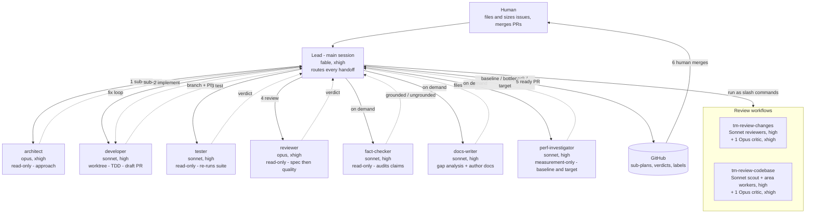

# OrchestrAI

A personal AI-team-orchestrator plugin: a `CLAUDE.md`, a bootstrap
checklist, and a ready-made agent team, adopted into your existing repos.
Runs on Claude Code (via the plugin marketplace) and on Hermes Agent
(via a Hermes skill), with any model including GLM-5-2.

- `CLAUDE.md` - standing guidance for Claude Code sessions: what the repo is,
  where decisions live, code style, useful commands.
- `.claude/team-guide.md` - team-specific process guidance (agent team,
  advisor model, model policy, how-to-pick-up-a-task, repo layout).
  `.claude/process-core.md` holds the neutral rules that hold regardless of
  team or model (issues/branches/commits conventions, sizing, sub-plans,
  tests, CI cost policy, writing style, what-not-to-do). The repo `CLAUDE.md`
  imports both files directly, core first; a config dir imports both from the
  marketplace clone instead (see "Getting the team into your repos" below).
- `NEW-PROJECT-SETUP.md` - the once-per-repo adoption checklist: branch
  protection, installing the plugin, docs structure, CI/CD and e2e wiring,
  and the first slice of work. Stays in the repo as a living checklist; it
  is not deleted once checked off.
- `.claude/agents/` - the role agents: architect (approach, read-only),
  developer (one issue end to end, worktree-isolated), tester (independent
  verification, read-only), reviewer (spec pass then quality pass, read-only),
  fact-checker (audits report and PR claims against evidence, read-only),
  docs-writer (authors user-facing docs from a gap analysis, on demand),
  perf-investigator (measures a baseline and target for a reported slowness,
  read-only except for measurement).
- `.claude/adapters/` - the portable adapter layer. Adapter tables
  (`claude-code.json`, `hermes.json`, `codex.json`) map model tiers
  (judgment, worker, lead) to concrete models per host. Adapter modules
  implement the spawn/detectFailure/retry interface for each host. Role
  prompt templates (`prompts/<role>.md`) carry the host-neutral job
  descriptions and report contracts. See
  `docs/architecture/adapter-interface.md` for the interface contract and
  `docs/architecture/hermes-adapter.md` / `docs/architecture/codex-adapter.md`
  for host-specific docs.
- `.claude/skills/tm-advisor/` - `/tm-advisor`: the operating model on top of the
  team. Refines a raw need into a batch of work packages, takes one sign-off,
  runs the batch uninterrupted through the kickoff pipeline, and reports.
  State lives in a batch tracking issue, so a dropped session resumes. Design:
  `docs/superpowers/specs/2026-06-12-advisor-operating-model-design.md`.
- `.claude/skills/tm-kickoff/` - `/tm-kickoff`: fans refined, sized issues out to
  the agent team in parallel waves, through implement, test, and review, to a
  ready PR per issue.
- `.claude/skills/tm-grill-me/` - `/tm-grill-me`: stress-tests a plan one question
  at a time before kickoff (from mattpocock/skills, MIT).
- `.claude/skills/tm-ab-test/` - `/tm-ab-test`: runs a paired A/B comparison of
  two orchestration-variant arms on one task, forked from the same base
  commit and run sequentially (headless or human-supervised). Records agent
  count, wall-clock time, token usage, diff size, and an independent review
  per arm, then writes a dated report and appends a row to
  `docs/reviews/ab-tests.md`. Sequences existing machinery only; no new
  agent, no new workflow script.
- `.claude/skills/tm-new-project/` - `/tm-new-project`: runs the
  `NEW-PROJECT-SETUP.md` checklist as a guided flow. Creates the workflow
  labels and docs tree, then prints the human-only steps (branch protection,
  CI, plugin install, design-plugin vetting). Idempotent, and does not
  delete `NEW-PROJECT-SETUP.md`.
- `.claude/workflows/` - bounded orchestration scripts. `tm-review-changes`
  reviews a diff with a fixed set of Sonnet reviewers plus one Opus critic;
  `tm-review-codebase` audits the whole repo with a Sonnet scout that splits it into
  areas (scaled to the repo, capped at a ceiling), per-area Sonnet workers, an
  architecture worker, and one Opus critic. Both pin models in-script so the cost
  is bounded by construction. Fan-out is encoded as JSON data specs under
  `workflows/specs/`; the JS files embed matching SPEC constants and a sync
  test asserts they stay aligned.
- `.claude/settings.json` - enables obra's superpowers plugin per project
  (`superpowers@claude-plugins-official`; the methodology skills:
  brainstorming, writing-plans, TDD, verification).
- `.claude-plugin/marketplace.json` - the marketplace catalog, pointing the
  `orchestrai` plugin at the `.claude/` root. The plugin manifest itself lives
  at `.claude/.claude-plugin/plugin.json` (see "Getting the team into your
  repos" below).

Generalized from two project `CLAUDE.md` files (a Python advisory bot and a
TypeScript web app), keeping the shared backbone and dropping the project
specifics.

The four global coding principles live in `~/.claude/CLAUDE.md` and apply to
every project; this plugin references them rather than repeating them.

## How the team works


```mermaid
graph TD
    H["Human<br/>files and sizes issues, merges PRs"] --> L
    L["Lead - main session<br/>fable, xhigh<br/>routes every handoff"]

    L -->|"1 sub-plan"| A["architect<br/>opus, xhigh<br/>read-only - approach"]
    A -.->|"sub-plan"| L
    L -->|"2 implement"| D["developer<br/>sonnet, high<br/>worktree - TDD - draft PR"]
    D -.->|"branch + PR"| L
    L -->|"3 test"| T["tester<br/>sonnet, high<br/>read-only - re-runs suite"]
    T -.->|"verdict"| L
    L -->|"4 review"| R["reviewer<br/>opus, xhigh<br/>read-only - spec then quality"]
    R -.->|"verdict"| L
    L -.->|"fix loop"| D
    L -->|"on demand"| F["fact-checker<br/>sonnet, high<br/>read-only - audits claims"]
    F -.->|"grounded / ungrounded"| L
    L -->|"on demand"| DW["docs-writer<br/>sonnet, high<br/>gap analysis + author docs"]
    DW -.->|"files written"| L
    L -->|"on demand"| P["perf-investigator<br/>sonnet, high<br/>measurement-only - baseline and target"]
    P -.->|"baseline / bottleneck / target"| L

    L -->|"5 ready PR"| G[("GitHub<br/>sub-plans, verdicts, labels")]
    G -->|"6 human merges"| H

    subgraph WF["Review workflows"]
        RC["tm-review-changes<br/>Sonnet reviewers, high<br/>+ 1 Opus critic, xhigh"]
        RB["tm-review-codebase<br/>Sonnet scout + area workers, high<br/>+ 1 Opus critic, xhigh"]
    end

    L -->|"run as slash commands"| WF
```

## Getting the team into your repos

Two ways, depending on whether the team should be committed to the repo.

**Plugin install, via the marketplace (recommended).** This repo is a
single-plugin marketplace (`.claude-plugin/marketplace.json`), so any machine
with Claude Code can install the team without cloning or copying anything,
including a user config dir for repos you must not commit the team to (an
org's private repo):

```text
/plugin marketplace add sv-tmueller/orchestrai
/plugin install orchestrai@orchestrai
```

This installs the agents and all 7 skills under the `orchestrai` namespace,
for example `/orchestrai:tm-advisor` and `/orchestrai:tm-kickoff`. The two
review workflows (`tm-review-changes`, `tm-review-codebase`) ship as thin
wrapper skills, since plugin `workflows/` is not an official component type.
Current Claude Code builds may also register the two workflows directly under
the plugin namespace, producing duplicate menu entries; this is undocumented
behavior, and the wrapper skills remain the supported path.

A plugin cannot place `team-guide.md` and `process-core.md` where a config-dir
`CLAUDE.md` can import them, so wire both imports yourself: add

```text
@plugins/marketplaces/orchestrai/.claude/process-core.md
@plugins/marketplaces/orchestrai/.claude/team-guide.md
```

to `<config-dir>/CLAUDE.md` (the paths are relative to that file; the
marketplace clone auto-updates, so the imports always track the latest
guides). A nested import from `team-guide.md` to `process-core.md` does not
resolve for a plugin consumer, so both files must be imported directly; if
your config dir already has the single `team-guide.md` import line from
before this change, add the `process-core.md` line above it. Note that a
config-dir `CLAUDE.md` replaces `~/.claude/CLAUDE.md` instead of stacking
with it, so re-import the four global coding principles in the same file if
you rely on them. A repo that carries its own committed team overrides the
plugin's copy, so the two never clash.

A plugin cannot install another plugin for you: the `developer` and `tester`
agents and `tm-advisor` depend on obra's superpowers plugin, so enable it
yourself first if it is not already:

```text
/plugin marketplace add anthropics/claude-plugins-official
/plugin install superpowers@claude-plugins-official
```

**Committed in the repo.** Copy the whole `.claude/` tree from this repo into
yours instead of installing the plugin, for a repo where the team must be
committed rather than installed from the marketplace. To update it later,
copy the changed files from this repo's `.claude/` into the target repo's
`.claude/` and open a PR.

## Running on Hermes Agent (GLM-5-2 and other models)

The orchestrator team also runs on Hermes Agent, not just Claude Code. The
same flat-star pipeline (architect, developer, tester, reviewer) works on
any model configured in your Hermes config, including GLM-5-2. The lead
session dispatches role agents via `delegate_task`; the adapter table
(`.claude/adapters/hermes.json`) maps tiers to concrete models.

### Installing the Hermes skill

The Hermes skill is bundled as a builtin at
`~/.hermes/skills/autonomous-ai-agents/orchestrai/`. It is auto-discovered:
run `hermes skills list` and look for `orchestrai` in the
`autonomous-ai-agents` category. No install step is needed on the machine
where the skill files are present.

To install it on another machine, publish the skill directory as a GitHub
repo and tap it:

```bash
hermes skills tap add sv-tmueller/orchestrai
hermes skills install orchestrai
```

### Using it

Preload the skill and run a one-shot:

```bash
hermes -s orchestrai chat -q "Run the orchestrator team on issue #42"
```

Or preload and run interactively:

```bash
hermes -s orchestrai
> Run the orchestrator team on issue #42
```

The lead session (whatever model you configured, e.g. GLM-5-2) reads the
skill, follows the flat-star pipeline, and dispatches each role agent via
`delegate_task` as a leaf worker. Role prompts (job descriptions,
guardrails, report contracts) are loaded from the skill's
`references/roles/` directory.

### How it maps to Hermes

| Claude Code | Hermes |
|---|---|
| Agent tool dispatch | `delegate_task` with `role="leaf"` |
| Workflow tool `agent()` / `parallel()` | `delegate_task` (sequential or batch) |
| Worktree isolation | Branch isolation via terminal in the delegated session |
| `gh pr diff`, `gh issue view` | `terminal` tool with `gh` commands |
| Frontmatter `model:` / `effort:` | Adapter table `hermes.json` tier mapping |
| `CLAUDE.md` project rules | `AGENTS.md` (auto-loaded by Hermes) |

### Model configuration

The adapter table at `.claude/adapters/hermes.json` maps the three tiers:

```json
{
  "tiers": {
    "judgment": { "model": "vllm/release/glm-5-2", "effort": "xhigh" },
    "worker":   { "model": "vllm/release/glm-5-2", "effort": "high" },
    "lead":     { "model": "vllm/release/glm-5-2", "effort": "xhigh" }
  }
}
```

To use a cheaper model for worker-tier agents (developer, tester,
fact-checker), edit the `worker` entry. The Hermes config
(`~/.hermes/config.yaml`) pins the provider and base URL; the adapter
table only declares which model ID each tier uses.

See `docs/architecture/hermes-adapter.md` for full documentation.

## Running on Codex (subscription auth)

The Codex adapter runs the same pipeline on OpenAI's Codex CLI with
ChatGPT subscription auth (Plus/Pro), no metered API keys. Verified in
`docs/research/2026-08-14-codex-subscription-auth-spike.md`. The adapter
table at `.claude/adapters/codex.json` maps tiers to o3 (judgment) and
gpt-5.6 (worker). See `docs/architecture/codex-adapter.md` for
documentation.

## License

**Copyright © 2026 Thomas Mueller. All rights reserved.**

This source code is published for demonstration and portfolio purposes only. No license is granted to use, copy, modify, merge, publish, distribute, sublicense, or sell any part of this software, in whole or in part, in any other project (public or private) without prior written permission from the copyright holder.

Unauthorized reuse of any portion of this code constitutes copyright infringement and will be pursued accordingly.

### Third-party material

One skill carries its own MIT attribution because it is adapted from an
MIT-licensed source: `.claude/skills/tm-grill-me/SKILL.md` (near-verbatim,
from `mattpocock/skills`). Its attribution footer and the source project's
full MIT license text are in `THIRD_PARTY_NOTICES.md`. This does not change
the license of the rest of the repo above; it is a normal mixed-license
pattern where a small amount of MIT-derived material keeps its own
attribution inside an otherwise all-rights-reserved codebase.

The research on `vijaythecoder/awesome-claude-agents`
(`docs/research/2026-07-04-awesome-claude-agents-adoption.md`) and the
flat-star diagram credit to `owainlewis/youtube-tutorials`
(`docs/team-architecture.md`) use only ideas and observations from those
sources, not file copies, so no attribution is required for them beyond the
credit already given in place.
