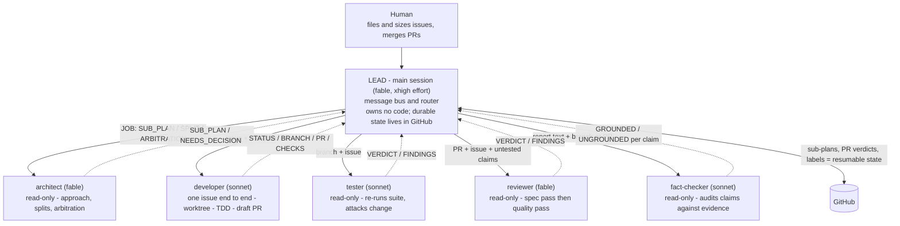
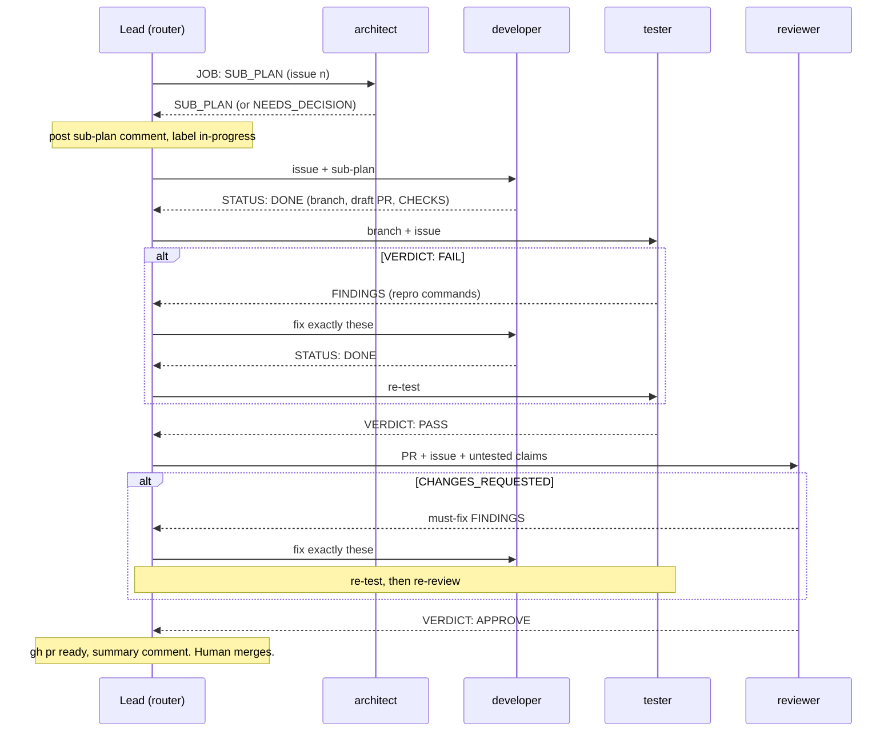

# Agent team architecture

How the orchestrator team actually runs. The operating rules live in
`.claude/team-guide.md`; this doc adds the picture. The per-package mechanics
(parking, caps, routing) live in `.claude/skills/tm-kickoff/SKILL.md`.

"Agent team" is this template's name for the flat-star pattern below, not
Claude Code's experimental agent-teams feature (enabled with
`CLAUDE_CODE_EXPERIMENTAL_AGENT_TEAMS`), where separate full sessions
coordinate peer-to-peer. Ours is built from subagents and dynamic workflows:
the lead spawns role agents that report back to it and never call each other.

## Flat star, not a nested tree

Claude Code now lets a subagent spawn its own subagents (a nested tree; the
tutorial this doc draws on reports a fixed depth cap, which we have not measured
here). We deliberately do not nest. The lead session is the only spawner and
routes every handoff. Three of the four role agents are read-only by tool
restriction; the developer writes code but is held to the same no-spawn rule, so
the star is structural, not just convention.

The reason is resumability. A nested tree lives and dies inside one session, so
a dropped connection loses the in-flight sub-tree. Our handoffs go through the
lead and land as GitHub artifacts (sub-plan comments, PR verdict comments,
labels), so a dropped session resumes from GitHub instead of restarting. We keep
the separation a nested model gives (one concern per agent, evidence flows up,
independent review, draft PR with the human merging) without trading away
resumability. Parallelism comes from worktree isolation, not nesting.

Five peers under one lead, no third level. Evidence flows back to the lead, which
routes it into the next agent. GitHub holds the state that makes a dropped
session resumable. The `fact-checker` sits outside the per-package pipeline:
the lead dispatches it on demand when a report's claims are load-bearing but
carry no evidence, and routes any CONTRADICTED claim back to the agent that
made it.

## The per-package pipeline

For one issue, the lead runs the agents in sequence and loops on failure. This is
the happy path with the two fix loops. It omits parking (`needs-human`),
`NEEDS_CONTEXT`, architect arbitration on developer pushback, and the 3-round fix
caps, all of which live in `.claude/skills/tm-kickoff/SKILL.md`.

Up to three packages run this pipeline at once, in isolated worktrees. The lead
never edits code; it routes reports and decides escalations.

---

Source: drawn from a tutorial on nested subagents in Claude Code
(owainlewis/youtube-tutorials), adapted to our flat-star model.
